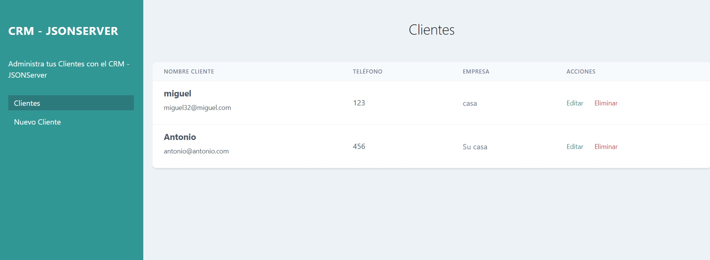

# CRUD-REST-JS
CRUD completo con JS

## Objetivo
+ Creacion de CRUD 
+ Conexion DB json
+ Validar formulario
+ Utilizacion de module en Javascript

### Visita el proyecto.

[Visita el proyecto](https://miguelpl32.github.io/CRUD-REST-JS/)

## Documentación
+ Iniciar proyecto se debe tener instalado NodeJS
+ Instalar el paquete JSON-SERVER (npm i -g json-server)
+ Para iniciarlo ejecutar en consola json-server db.json -p 4000

## Tecnología
+ JavaScript
+ Nodejs
+ Tailwind
